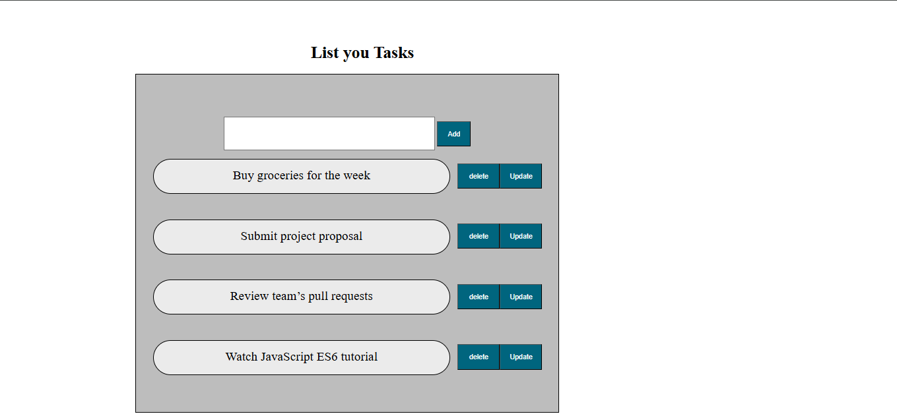

To-Do List Website 📝

A simple, responsive to-do list application built using HTML, CSS, and JavaScript. This app helps users manage their daily tasks efficiently with a clean and intuitive interface.

📸 Preview

🛠️ Built With

- HTML5
- CSS3 (Flexbox/Grid)
- Vanilla JavaScript

 ✨ Features

- Add new tasks
- Edit and delete tasks
- Responsive layout for desktop and mobile
- Save tasks in browser's local storage (persistent data)

